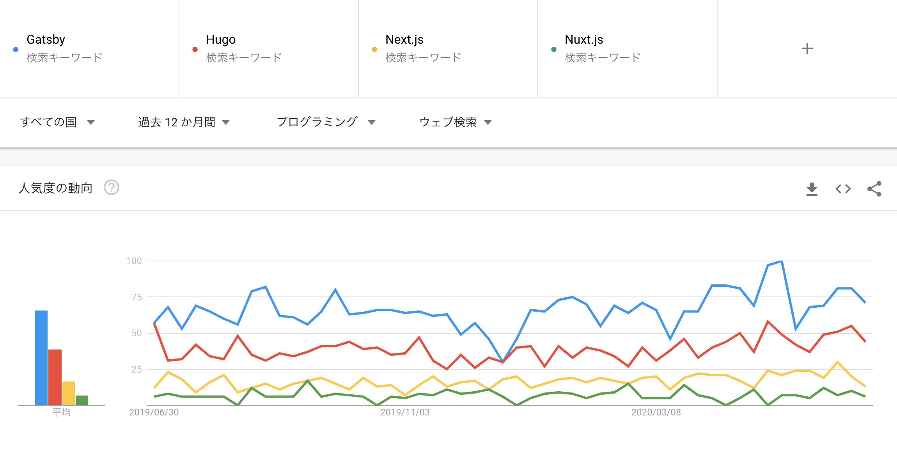

ふと思い立ってブログを開設しました。\
とあるベンダーでモバイル・WEB開発に従事しているaqtaと言います。\
本サイトでは、モバイル、ウェブ（フロントエンド・バックエンド）、インフラなど特に特定の技術にこだわらず、\
様々な記事を執筆していこうと思います。

とりあえず最初ということで、本記事ではブログサービスを簡単に構築できる`Gatsby`と`Netlify`について解説していこうと思います。
（実際に当サイトも同様の形で運用しています）

## GatsbyとNetlify
---

### Gatsby

* Reactというjavascriptのフレームワークを利用して作られた、静的サイトジェネレータ。
* 他にも、Go言語で書かれた`Hugo`や、Vueを使った`NEXT.js`,`NUXT.js`などがあります。
* いくつかグーグルトレンドで比較しましたが、今の所はGatsbyが優勢のようですね



## なぜGatsbyを選んだか？

---

### **GraphQLの存在**
GraphQLというものについてはGatsbyに触れるまで存在を知らなかったのですが、\
クライアントでクエリを書くことで、同様の形のJsonをサーバから取得でき、クエリからレスポンスの構造が把握できるというのがとても便利です。\
従来のRestAPIよりもコードの品質が上がったり、クライアント・サーバ間の齟齬が減るのではないかと思います。\
Gatsbyに関してはサーバ側とか意識する必要はほぼないですが、GraphQLそのものの学習コストが低いので、カスタマイズがしやすいというのは利点ですね。

### **Reactベースのフレームワーク**
ReactそのものがまずJSのフレームワークですが、そのReactベースでGatsbyは開発されています。\
各画面の描写にはPropsが使われており、GraphQLでクエリを介して取得したデータがReactコンポーネントのpropに渡り、ページを表示しています

```js:title=blog-spot.js
BlogPost.propTypes = {
  data: PropTypes.shape({
    markdownRemark: PropTypes.object,
  }),
}

export default BlogPost

export const pageQuery = graphql`
  query BlogPostByID($id: String!) {
    markdownRemark(id: { eq: $id }) {
      id
      html
      frontmatter {
        date(formatString: "YYYY/MM/DD")
        title
        description
        tags
      }
    }
  }
`

```

Reactには興味があったものの、もともとWebフロントの案件開発者ではないので、どうやって学習していこうか悩んでいました。\
そこで、Gatsbyによるブログの構築とカスタマイズを通してReactの記法を勉強できるという部分に魅力を感じました
