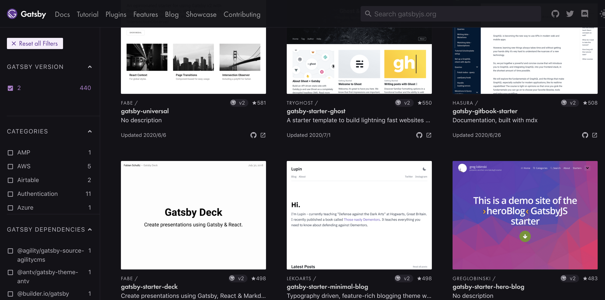

ふと思い立ってブログを開設しました。とあるベンダーでモバイル・WEB開発に従事しているaqtaと言います。\
本サイトでは、モバイル、ウェブ（フロントエンド・バックエンド）、インフラなど特に特定の技術にこだわらず\
様々な記事を執筆していこうと思います。

## GatsbyとNetlify
---

とりあえず最初ということで、本記事ではブログサービスを簡単に構築できる`Gatsby`と`Netlify`について解説していこうと思います。
（実際に当サイトも同様の形で運用しています）

### Gatsby
https://www.gatsbyjs.org/
* Reactというjavascriptのフレームワークを利用して作られた、静的サイトジェネレータ。
* 他にも、Go言語で書かれた`Hugo`や、Vueを使った`NEXT.js`,`NUXT.js`などがあります。
* いくつかグーグルトレンドで比較しましたが、今の所はGatsbyが優勢のようですね


## なぜGatsbyを選んだか？

---

### **GraphQLの存在**
GraphQLというものについてはGatsbyに触れるまで存在を知らなかったのですが、\
クライアントでクエリを書くことで、同様の形のJsonをサーバから取得でき、クエリからレスポンスの構造が把握できるというのがとても便利です。\
従来のRestAPIよりもコードの品質が上がったり、クライアント・サーバ間の齟齬が減るのではないかと思います。\
Gatsbyに関してはサーバ側とか意識する必要はほぼないですが、GraphQLそのものの学習コストが低いので、カスタマイズがしやすいというのは利点ですね。

### **Reactベースのフレームワーク**
ReactそのものがまずJSのフレームワークですが、そのReactベースでGatsbyは開発されています。\
各画面の描写にはPropsが使われており、GraphQLでクエリを介して取得したデータがReactコンポーネントのpropに渡り、ページを表示しています

```js:title=blog-spot.js
BlogPost.propTypes = {
  data: PropTypes.shape({
    markdownRemark: PropTypes.object,
  }),
}

export default BlogPost

export const pageQuery = graphql`
  query BlogPostByID($id: String!) {
    markdownRemark(id: { eq: $id }) {
      id
      html
      frontmatter {
        date(formatString: "YYYY/MM/DD")
        title
        description
        tags
      }
    }
  }
`

```

Reactには興味があったものの、もともとWebフロントの案件開発者ではないので、どうやって学習していこうか悩んでいました。\
そこで、Gatsbyによるブログの構築とカスタマイズを通してReactの記法を勉強できるという部分に魅力を感じました

## Netlify

* 静的サイトをホスティングする事ができるWebサービス
* 同じようなサービスに、`Firebase``Github Pages` などがありますね
* 非常に簡単に静的サイトを公開できますし、ちゃんとhttps化されていたり、独自ドメインの登録も簡単です

### なぜNetlifyを(略
もともとgithub pagesを使っていましたが、静的サイトジェネレータで出力した構成だと、サブディレクトリを読ませる必要があるのですが、\
少し手間がかかるのが嫌でした\
そもそも` jekyll`というほぼ専用みたいなジェネレータを使う事が前提にありました。 ただ、それでも機能が制限されているので、使いづらかったです。\n
その点Netlifyはかなり自由度が高く、簡単な機能であればAWSのLambdaも使えたりするみたいです

## 所感
こうした静的サイトやホスティングサービスについては、まさしく群雄割拠といった状況で、どのサービスも一長一短ありそうですが、\
現在の潮流として感じたのは、Gatsbyだけで機能的には十分効果的なサイトが作れるという事です。\
Reactの知識やJSに慣れ親しんでいないと導入の際に少しつまづきそうですが、とにかくSEOバッチリで簡単かつ手軽にサービスを開始したいという場合は、\
テンプレートを使う事で解決できると思います。\
https://www.gatsbyjs.org/starters/?v=2



ブログ、LP、動的にデータを変えないペラHPなどであれば、即形にできるというのがかなりの強みと感じました。